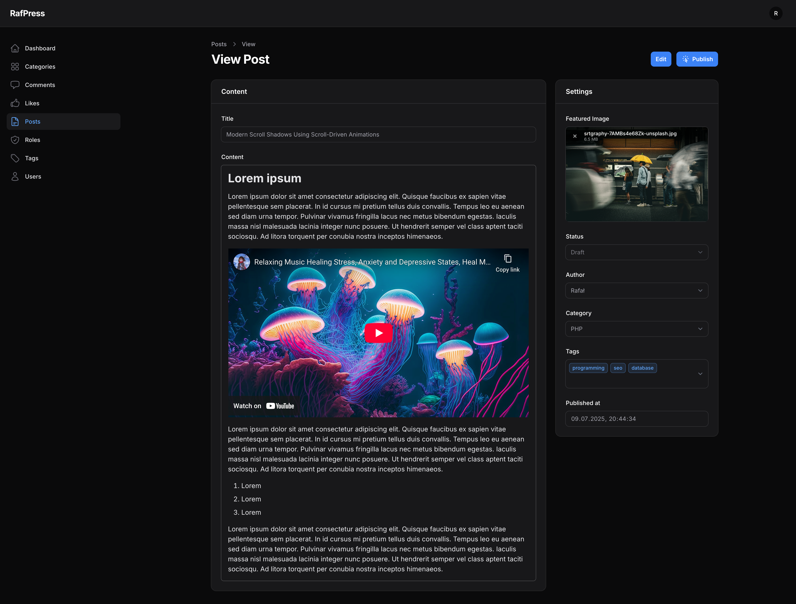

# **📰 RafPress**

**RafPress** to prosty system blogowy zbudowany w oparciu o **Laravel**, **MySQL** oraz **Filament PHP**. Projekt posiada panel administracyjny z możliwością zarządzania treściami, użytkownikami, kategoriami i tagami, oraz systemem wysyłki powiadomień e-mail przy publikacji postów.

## **🔧 Stack technologiczny**
-   **Backend**: Laravel 11
-   **Baza danych**: MySQL
-   **Panel administracyjny**: Filament PHP v3
-   **Wysyłka e-maili**: Laravel Mail

## **✨ Funkcje**
-   CRUD postów z obsługą:
    -   zdjęcia,
    -   treści,
    -   tagów,
    -   kategorii,
    -   autora,
    -   statusu (draft, published, archived),
    -  komentarzy,
    - polubień (posty i komentarze)
-   Przycisk Publish dostępny z widoku posta
-   Automatyczna wysyłka e-maila po publikacji posta do administratorów
-   System powiadomień w panelu Filament
-   Podstawowy dashboard z widgetami statystycznymi
- Uprawnienia dla różnych typów kont (Admin i Editor)

## **🔌 API i frontend**
W planach znajduje się wystawienie **API REST** oraz stworzenie przykładowej strony frontendowej w **Vue.js**, umożliwiającej:
-   podgląd opublikowanych postów,
-   komentowanie,
-   polubienia,
-   autentykację użytkowników komentujących i lajkujących.
